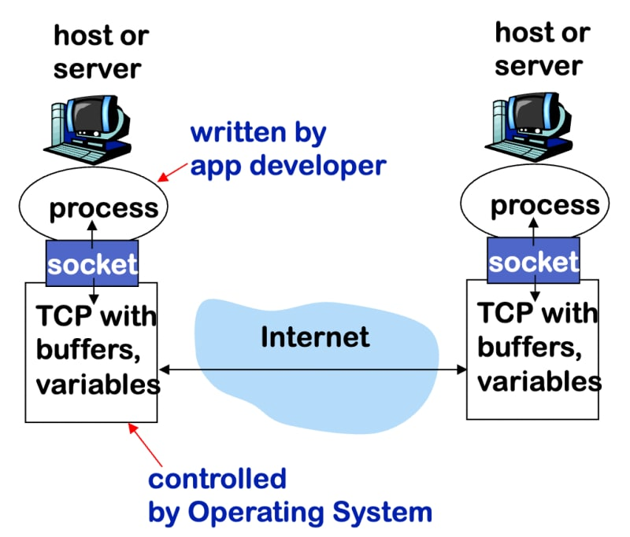

# Web Server




# How To Compile

```
gcc server.c -o server -pthread
```

This option tells the compiler to link your program with the pthread library and include the necessary support for threading.

So, make sure you add the -pthread option when compiling your program to resolve the "undefined reference" errors related to pthread functions.


### How I Built a Simple HTTP Server from Scratch using C from [Jeffrey Yu](https://dev.to/jeffreythecoder/how-i-built-a-simple-http-server-from-scratch-using-c-739)
